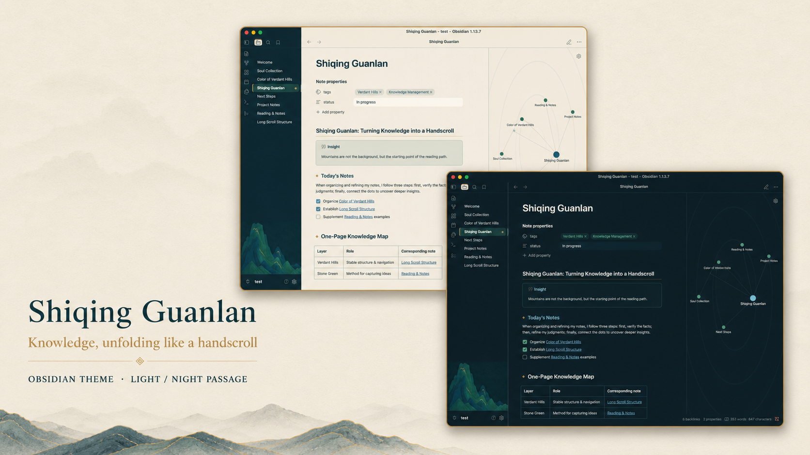

# Shiqing Guanlan · 石青观澜

[简体中文](README.zh-CN.md) | English

An Obsidian theme inspired by the mineral blues and greens, handscroll rhythm, and layered distance of Chinese *qinglü shanshui* (青绿山水, blue-green landscape painting).

## Two appearances

Shiqing Guanlan follows Obsidian's native appearance setting. It does not add a separate theme switcher.

- **Qingben · 晴本** — warm stone-paper notes within a deep mineral-blue application shell.
- **Night Passage · 夜航** — a blue-black writing field with pale ink text and the same azurite/malachite hierarchy.

> The 512×288 `screenshot.png` and `screenshot-dark.png` files are retained for the Obsidian Community Theme directory; these full-size previews are for close inspection on GitHub.

Both appearances use the landscape as a subdued backdrop at the bottom of the left file explorer. The file list scrolls above it instead of losing space to a separate image zone. The editor and right sidebar remain decoration-free so that writing, navigation, properties, outlines, and plugin inputs stay unobstructed.

## Cultural background

### Qinglü shanshui

Blue-green landscape is one of the early established modes of Chinese landscape painting. Its defining materials are mineral pigments, especially **azurite blue (石青)** and **malachite green (石绿)**. Unlike a flat digital teal palette, mineral color is built through layers: dense and luminous in one passage, lighter in another, often balanced by ink, earth tones, and restrained gold.

This theme translates those principles rather than reproducing a painting as interface wallpaper:

- azurite blue establishes the stable application shell;
- malachite green marks active navigation and interaction;
- warm stone-paper supports long-form reading;
- aged gold is reserved for small hierarchy cues;
- overlapping mountain shoulders and contour strata appear only at the interface edge;
- the scroll's changing distances become a calm hierarchy between navigation, writing, and supporting panels.

### Wang Ximeng and *A Thousand Li of Rivers and Mountains*

The primary cultural reference is Wang Ximeng's (王希孟) Northern Song handscroll *A Thousand Li of Rivers and Mountains* (《千里江山图》), held by the Palace Museum in Beijing. The museum describes it as an ink-and-color painting on silk, 51.5 cm high and 1,191.5 cm long. A contemporary colophon records that Wang was eighteen; the work is generally associated with 1113, the third year of the Zhenghe reign.

The scroll is a canonical monument of Song blue-green landscape. It uses the traditional *qinglü* method, with azurite and malachite mineral pigments as its principal colors. Across a handscroll more than eleven metres long, mountain masses, rivers, bridges, dwellings, waterfalls, and paths form connected but changing scenes. Multiple modes of distance create the experience of moving through the landscape rather than viewing it from a single fixed point.

That spatial logic matters to the theme as much as the famous color. Shiqing Guanlan uses layered depth, changing visual density, and a long horizontal mountain cadence while keeping the note itself quiet. The result is an interface informed by Chinese painting structure—not a decorative “Chinese-style” skin.

[Read the Palace Museum's catalogue entry](https://minghuaji.dpm.org.cn/paint/detail?id=b0a15b3767a5c12089ec45563741112b) · [View a public-domain full-scroll reproduction on Wikimedia Commons](https://commons.wikimedia.org/wiki/File:Wang_Ximeng._A_Thousand_Li_of_Rivers_and_Mountains._(Complete,_51,3x1191,5_cm)._1113._Palace_museum,_Beijing.jpg)

> Artwork note: the reproduction above is linked from Wikimedia Commons and marked there as public domain. The installed theme does not bundle this reproduction. Its sidebar mountain is an original theme asset informed by the blue-green landscape tradition, not a crop of the historical scroll.

## Theme features

- Light and dark appearances using Obsidian's native toggle.
- Readable Chinese and Latin font stacks.
- High-contrast editor text, headings, links, lists, tables, blockquotes, code, tags, callouts, and checkboxes.
- Coordinated title bar, tabs, ribbon, file explorer, menus, modals, and graph view.
- A tinted landscape backdrop beneath the file tree, without reserving or blocking list space.
- A decoration-free right sidebar for outlines, properties, chat panels, and inputs.
- Opaque sidebar surfaces when Obsidian translucency is enabled.
- Reduced-motion support.

## Installation

### Install manually

1. Download `manifest.json` and `theme.css` from the latest release.
2. In your vault, create `.obsidian/themes/Shiqing Guanlan/`.
3. Copy both files into that folder.
4. Open **Settings → Appearance → Themes** in Obsidian.
5. Select **Shiqing Guanlan**.

### Switch appearance

Use Obsidian's standard **Settings → Appearance → Base color scheme** control:

- Light activates **Qingben · 晴本**.
- Dark activates **Night Passage · 夜航**.

## Compatibility

- Obsidian 1.12.0 or later.
- Tested in the Obsidian 1.13 desktop app on macOS.
- The core palette uses Obsidian CSS variables; a small set of desktop selectors completes the title bar, navigation, and sidebar treatment.

## Credits and sources

- Cultural and visual tradition: Chinese *qinglü shanshui* mineral-color landscape painting.
- Primary artwork reference: Wang Ximeng, *A Thousand Li of Rivers and Mountains*, Northern Song, ca. 1113, Palace Museum, Beijing.
- Artwork history and dimensions: [Palace Museum catalogue](https://minghuaji.dpm.org.cn/paint/detail?id=b0a15b3767a5c12089ec45563741112b).
- Linked full-scroll reproduction: [Wikimedia Commons](https://commons.wikimedia.org/wiki/File:Wang_Ximeng._A_Thousand_Li_of_Rivers_and_Mountains._(Complete,_51,3x1191,5_cm)._1113._Palace_museum,_Beijing.jpg), Public Domain Mark.
- The theme's sidebar mountain artwork and UI previews are project assets; they are not taken from the historical painting.

## License

The theme source and original project assets are released under the [MIT License](LICENSE). Linked museum or Wikimedia material is governed by its own source-page terms.
