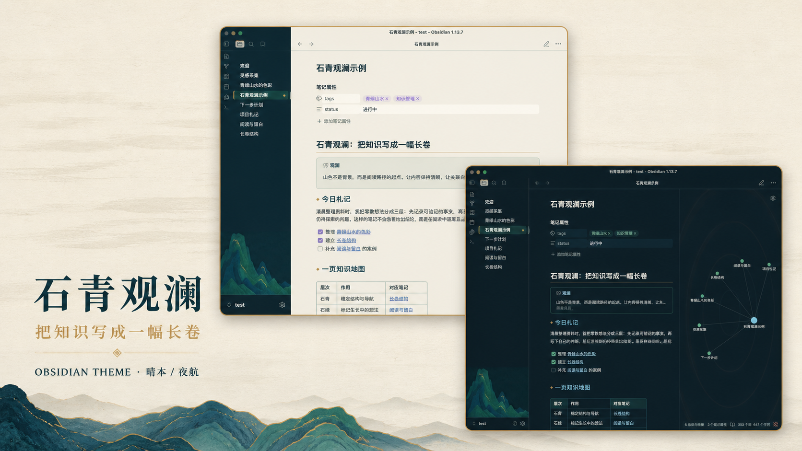
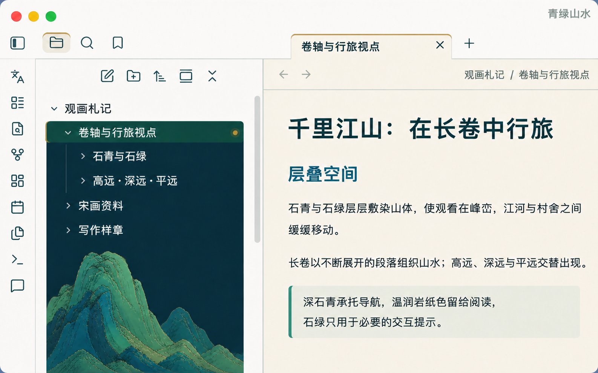
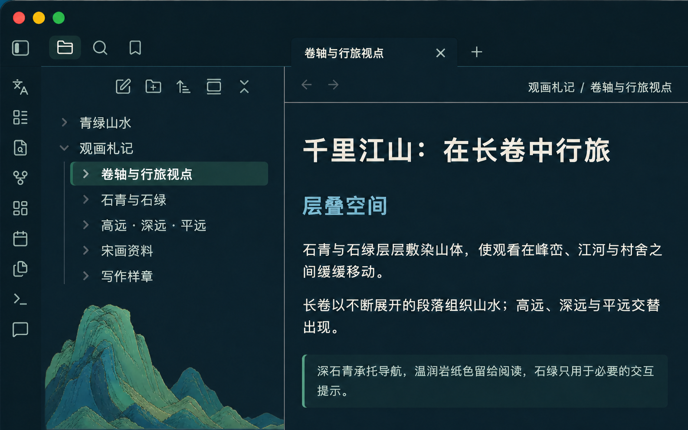

# 石青观澜 · Shiqing Guanlan

简体中文 | [English](README.md)

一套从中国青绿山水的矿物设色、长卷节奏与层叠空间中提取设计语言的 Obsidian 主题。

## 两套外观

石青观澜跟随 Obsidian 原生的明暗外观设置，不另造一套切换机制。

- **晴本**：深石青应用外壳包围温润的岩纸色正文，适合长时间阅读与写作。
- **夜航**：蓝黑色写作场配合浅墨文字，延续同一套石青、石绿层级。

> `screenshot.png` 与 `screenshot-dark.png` 保留为 Obsidian 社区主题目录需要的 512×288 缩略图；这里展示的是用于在 GitHub 查看细节的高清预览图。

两种外观都把山水作为左侧文件树底部的低对比度衬底，文件列表可在其上方完整滚动，不再单独占用一块空间。正文与右侧栏不放装饰，避免遮挡写作、导航、属性、大纲以及插件输入框。

## 中国文化背景

### 青绿山水与矿物设色

青绿山水是中国山水画中形成很早的一种传统。它最有辨识度的材料是矿物颜料，尤其是 **石青** 与 **石绿**。这种颜色并不是现代界面里一层扁平的蓝绿色：矿物色通过反复敷染形成厚薄、明暗与冷暖变化，再与水墨、赭色和少量金色彼此平衡。

本主题转译的是这种设色原则和空间方法，而不是把古画直接铺成软件壁纸：

- 以石青建立稳定、安静的应用外壳；
- 以石绿标记选中状态和关键交互；
- 以岩纸色承托长文阅读；
- 以克制的泥金色提示层级；
- 山肩、谷口和层叠皴线只停留在界面边缘；
- 将长卷中的远近变化转化为导航、正文和辅助面板之间的视觉层次。

### 王希孟与《千里江山图》

本主题最重要的文化参照，是北京故宫博物院藏北宋王希孟《千里江山图》卷。故宫资料记载，该作为绢本设色，纵 51.5 厘米、横 1191.5 厘米。卷后蔡京题跋称王希孟当时十八岁；作品一般系于宋徽宗政和三年（1113）。

《千里江山图》是宋代青绿山水的代表性巨制。它继承传统“青绿法”，以石青、石绿等矿物颜料为主要色彩。在十一米多的长卷中，峰峦、江河、桥梁、村舍、飞瀑与路径组成彼此连接、又不断变化的段落；高远、深远、平远等空间方式交替出现，使观看成为在山水中移动的过程，而不是面对一个固定视点。

这套主题借鉴的不只是《千里江山图》最醒目的青绿色，也包括它组织空间的方式：层叠而不拥挤，绵延而有停顿，局部精细而整体开阔。左下角山体承担“卷首”般的视觉引导，正文则保持清朗。它希望表达的是中国山水画的结构与观看方式，而不是泛化的“中式风格”装饰。

[阅读北京故宫博物院作品资料](https://minghuaji.dpm.org.cn/paint/detail?id=b0a15b3767a5c12089ec45563741112b) · [在 Wikimedia Commons 查看公版全卷图](https://commons.wikimedia.org/wiki/File:Wang_Ximeng._A_Thousand_Li_of_Rivers_and_Mountains._(Complete,_51,3x1191,5_cm)._1113._Palace_museum,_Beijing.jpg)

> 图像说明：上图从 Wikimedia Commons 外链，其文件页标记为公有领域。本主题安装包不内置这张原画复制图；左侧栏山体是受青绿山水传统启发的原创主题资源，并非从《千里江山图》中裁切。

## 主题特性

- 使用 Obsidian 原生切换的一套晴本与一套夜航。
- 兼顾中文与拉丁文字的字体栈。
- 正文、标题、链接、列表、表格、引用、代码、标签、Callout 与复选框均有清晰对比度。
- 统一顶栏、标签页、活动栏、文件树、菜单、弹窗和关系图的视觉层级。
- 山水作为文件树下方的渐隐衬底，不预留或阻断列表空间。
- 右侧栏保持无装饰，适合大纲、属性、聊天与输入控件。
- 开启 Obsidian 透明效果时，侧栏仍保持不透明石青底。
- 尊重系统“减少动态效果”设置。

## 安装

### 通过 Obsidian 安装

1. 打开 Obsidian 的**设置**。
2. 进入**外观**，在**主题**下点击**管理**。
3. 在社区主题中搜索 **Shiqing Guanlan**。
4. 点击**使用**。

### 切换晴本与夜航

使用 Obsidian 原生的 **设置 → 外观 → 基础配色方案**：

- 浅色外观对应 **晴本**。
- 深色外观对应 **夜航**。

## 兼容性

- Obsidian 1.12.0 及以上版本。
- 已在 macOS 的 Obsidian 1.13 桌面版中实际验证。
- 主要配色使用 Obsidian CSS 变量，少量桌面端选择器用于补全顶栏、导航与侧栏。

## 致谢与资料来源

- 文化与视觉传统：中国青绿山水的矿物设色传统。
- 主要作品参照：北宋王希孟《千里江山图》，约 1113 年，北京故宫博物院藏。
- 作品史、尺寸与技法：[北京故宫博物院作品资料](https://minghuaji.dpm.org.cn/paint/detail?id=b0a15b3767a5c12089ec45563741112b)。
- README 外链全卷复制图：[Wikimedia Commons](https://commons.wikimedia.org/wiki/File:Wang_Ximeng._A_Thousand_Li_of_Rivers_and_Mountains._(Complete,_51,3x1191,5_cm)._1113._Palace_museum,_Beijing.jpg)，文件页标记为 Public Domain Mark。
- 主题中的侧栏山体与界面预览为本项目资源，不取自历史原画。

## 许可证

主题源代码及本项目原创资源采用 [MIT License](LICENSE)。外链的博物馆与 Wikimedia 内容分别遵循其来源页面的授权说明。
